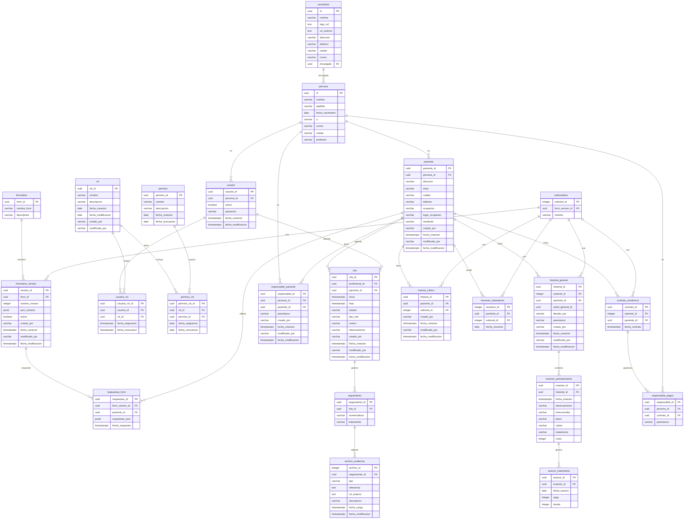

## Realizar Migraciones

dotnet ef migrations add NOMBRE --project Infrastructure --startup-project Web.API

## Aplicar Migraciones

dotnet ef database update --project Infrastructure --startup-project Web.API

## Diagrama de entidades

